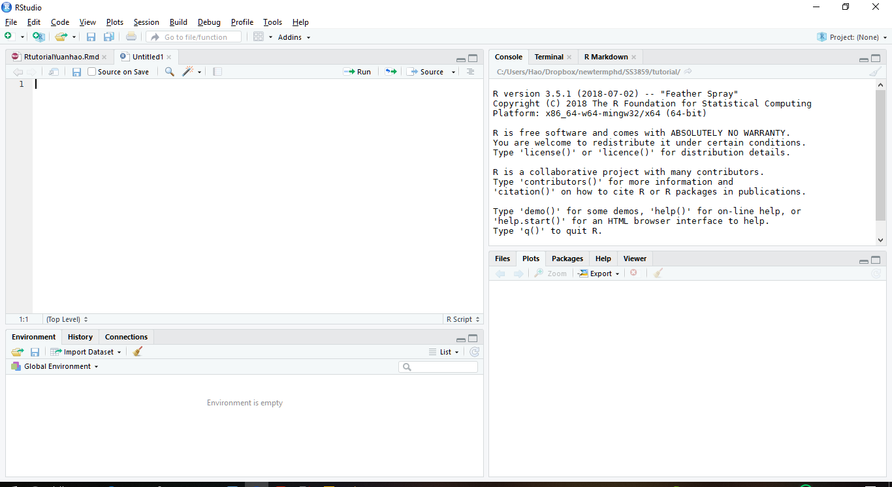
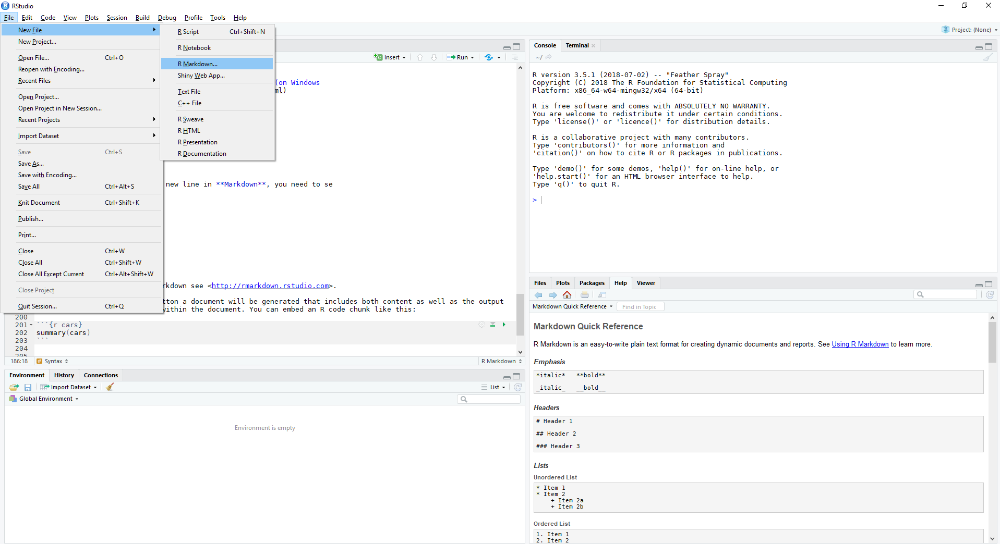
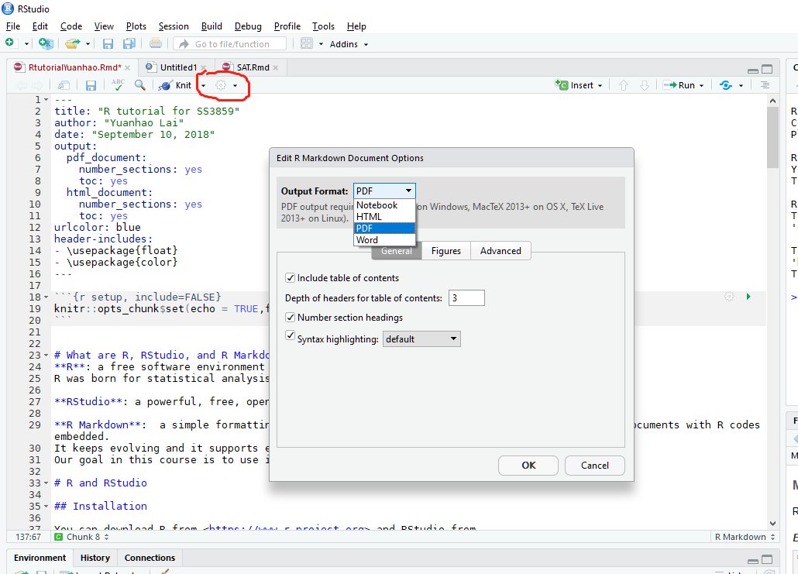
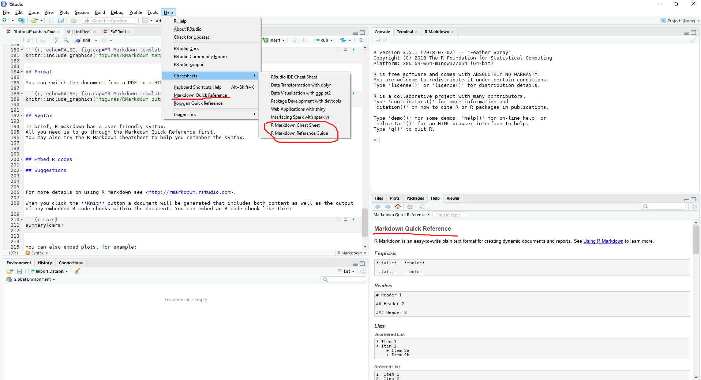
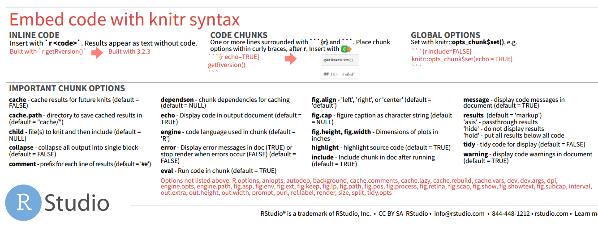

```{r setup, include=FALSE}
knitr::opts_chunk$set(echo = TRUE,fig.pos = 'H')
```


# What are R, RStudio, and R Markdown?
**R**: a free software environment for statistical computing and graphics. 
R was born for statistical analysis.

**RStudio**: a powerful, free, open-source integrated development environment for R.

**R Markdown**:  a simple formatting syntax (Markdown) for authoring HTML, PDF, 
and MS Word documents with R codes embedded.
R Markdown documents are fully **reproducible** and support dozens of static and dynamic output formats. 
It keeps evolving and it supports embeding interactive applications in a HTML page.
Our goal in this course is to use it to generate a PDF document.

In particular, this document was generated by R Markdown.

# R and RStudio

## Installation

You can download R from <https://www.r-project.org> and RStudio from <https://www.rstudio.com/products/rstudio/download/#download>.
Choose the version that fits your operating system (Windows or Mac).

## Use R

Once you have the R and RStudio ready, start RStudio and create a R script file.

```{r, echo=FALSE, fig.cap="Layout of RStudio", out.width = '100%'}

```


Below we show how to use R to solve **Exercise 1.3** in the textbook.

This exercise considers the **Automobile Insurance Claims data**, consisting of,

* STATE CODE: codes 01 through 17 used, with each code randomly
assigned to an actual individual state
* CLASS: rating class of operator, based on age, sex, marital status, and
use of vehicle
* GENDER: operator sex AGE: operator age
* PAID: amount paid to settle and close a claim.

You are focusing on older drivers, 50 and older, for which there are
n = 6,773 claims available.

* Examine the histogram of the amount PAID and comment on the symmetry. 
* Create a new variable, the (natural) logarithmic claims paid, LNPAID.
* Create a histogram and a qq plot of LNPAID. 
* Comment on the symmetry of this variable.
* Does it appear to be approximately normally distributed? \textcolor{red}{(I added this)}

### Read data
```{r}
# Read the data from a url
df<-read.csv("http://fisher.stats.uwo.ca/faculty/aim/2018/3859A/data/AutoClaims.csv", 
             header=TRUE)
```

### View data
These are common ways to check the data at the first stage.
There is a way to present the result more formally in R Markdown.
```{r}
# View data
str(df)
head(df,5)
```

### PAID
```{r, echo=TRUE, fig.align='center', fig.cap="Histogram of PAID", out.width = '70%'}
# Histogram of PAID
hist(df$PAID,xlab="PAID",main="",freq = FALSE) #freq=FALSE makes the area=1
```

**Comment**: 
The histogram of **PAID** appears to be skewed to the right.
We may also call this positive skew, right-skewed, or right-tailed.

### LNPAID

```{r, echo=TRUE, fig.align='center', fig.cap="Histogram of LNPAID with a normal curve superimposed", out.width = '70%'}
# The (natural) logarithmic claims paid
LNPAID <- log(df$PAID)

# Histogram of LNPAID 
hist(LNPAID,xlab="LNPAID",main="",freq = FALSE)

# Add an estimtaed normal curve 
curve(dnorm(x,mean=mean(LNPAID), sd=sd(LNPAID)),col="red",add = TRUE)
```

```{r, echo=TRUE, fig.align='center', fig.cap="Normal Q-Q plot of LNPAID", out.width = '70%'}
# qqplot of LNPAID
qqnorm(LNPAID, main = "") 
qqline(LNPAID)
```

**Comment**:
Both the histogram and the QQ-plot suggest that the logarithmic transformed variable, **LNPAID**, 
is symmetric and close to a normal distribution.

## How to learn R/data science?
Nowadays, there are a lot of resources available on the internet.

* [One comprehensive R book](https://genes.bibli.fr/doc_num.php?explnum_id=17689) for beginner is from Rmetrics.

* Ask and learn from *Google*? 
Most questions you will meet probably have appeared in *Stack Overflow*.

* If you are familiar with R and are enthusiatic in applying R on data analysis
besides linear regression,
I highly recommend you to take a look at [Kaggle's kernel playgroud](https://www.kaggle.com/kernels).
There you can find people use R/RMarkdown or Python to create excellent documents of data analysis.
You would benefit from their experiences.

* Data source for graduate students. 
Recently, Google announced their dataset search engine.(<https://toolbox.google.com/datasetsearch>) 
```{r, echo=FALSE, fig.cap="Google dataset search", out.width = '90%'}

```

# R Markdown

## Installation

A lot of people got in trouble in this step (lol).
To ensure that the RStudio can produce a PDF file correctly.
You need to make sure the following have been done.
Besides, it is good to keep R, RStudio and related R packages up to date.

Make sure that you had R and Rstudio, then open Rstudio and,
```{r, eval=FALSE}
# Install from CRAN
install.packages('rmarkdown')
```

In order to generate a PDF, a Latex distribution must be install.
For example, MikTex for windows and MacTex for Mac.
For R Markdown users who have not installed LaTeX before, 
the author of *rmarkdown* recommended the TinyTeX (<https://yihui.name/tinytex/>):
```{r, eval=FALSE}
install.packages("tinytex")
tinytex::install_tinytex()  # install TinyTeX
```

More references can be found below,

[R Markdown: The Definitive Guide](https://bookdown.org/yihui/rmarkdown/installation.html)

[Create PDF reports using R, R Markdown, LaTeX and knitr (on macOS High Sierra)](https://medium.com/@sorenlind/create-pdf-reports-using-r-r-markdown-latex-and-knitr-on-macos-high-sierra-e7b5705c9fd)

[Create PDF reports using R, R Markdown, LaTeX and knitr (on Windows 10)](https://bookdown.org/yihui/rmarkdown/installation.html)


## Start
We can start from creating a simple template.

```{r, echo=FALSE, fig.cap="R Markdown template", out.width = '100%'}

```

## Format 

You can switch the document from a PDF to a HTML easily.

```{r, echo=FALSE, fig.cap="R Markdown output format", out.width = '100%'}

```

## Syntax

In brief, R makrdown has a user-friendly syntax.
All you need is to go through the Markdown Quick Reference first.
You may also try the R Markdown cheatsheet to help you remenber the syntax.

Try a few example and get your hands dirty in order to learn.

```{r, echo=FALSE, fig.cap="R Markdown help mannual", out.width = '100%'}

```

**Line break:**

One thing you need to pay attention is that in order to begin a new line, 
you need add a empty line to seperate sentences.


R Markdown will treat multiple empty lines as one single line break.

## Embed R codes
There are two ways of embeding R codes in the R Markdown document, inline R code or R code Blocks.

**Inline text**:

There were `r nrow(cars)` cars studied.

**Code blocks**,

```{r}
summary(cars)
```

When you click the **Knit** button a document will be generated that includes both content as well as the output of any embedded R code chunks within the document. You can embed an R code chunk like this:

You can also embed plots and hide the codes by setting the option `echo = FALSE`, for example:

```{r pressure, echo=FALSE}
plot(pressure)
```

You can find summary of the important options from the R Markdown cheatsheet.
```{r, echo=FALSE, fig.cap="R Markdown chunk option", out.width = '100%'}

```

## Tables

Markdown has its own syntax to create a table, you may use,

First Header  | Second Header
------------- | -------------
Content Cell  | Content Cell
Content Cell  | Content Cell

You may use a [Markdown Tables Generator](https://www.tablesgenerator.com/markdown_tables) to do this.

To generate a table for the PDF/HTML from a R output, you may use the `stargazer` package,
```{r, results="asis", message=FALSE}
library(stargazer)
df<-read.csv("http://fisher.stats.uwo.ca/faculty/aim/2018/3859A/data/AutoClaims.csv", 
             header=TRUE)
             
# For pdf
stargazer(head(df,5), type="latex", title="First 5 observations", header=TRUE, summary=FALSE )

# For html
#stargazer(head(df,5), type="html", title="First 5 observations", header=TRUE, summary=FALSE )
```

There are more options of achieving this such as using the `kable()` fucntion.


## Suggestions

* The book, [R Markdown: The Definitive Guide](https://bookdown.org/yihui/rmarkdown/installation.html)
provides a comprehensive usage of R Markdown.
You may also use R Markdown to generate an interactive presentation slide or write a paper.

* RStudio provides a useful [tutorial](https://rmarkdown.rstudio.com/lesson-1.html).

* As your TA, I provide office hours by an email appointment (ylai72@uwo.ca, WSC236). 
I will often be available on Thursday.

* Suggestions are welcome if you want me to explain something particular during the tutorial.


